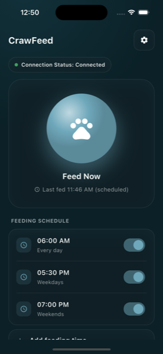

# CrawFeed

Flutter app for [PetFeederESP](https://github.com/menezmethod/PetFeederESP) — feed your pet on demand or on a
schedule, provision the feeder's Wi-Fi over Bluetooth, and see status live over MQTT.



## Features

- **Feed now**, with live confirmation from the device (not just "we sent it").
- **Up to 6 feeding schedules**, each with its own time and day-of-week (every day, weekdays, weekends, or a custom set).
- **Wi-Fi provisioning over Bluetooth** — pick the feeder's network from a live scan or type one in, no separate BLE terminal app needed.
- **Live connection status and last-fed history** over MQTT.
- **Secure by default**: MQTT over TLS with certificate pinning and username/password auth against a broker you control.
- **Multi-language ready** — built on `easy_localization`; adding a new language is a translation file, not a code change.
- Frosted-glass, light/dark UI.

Push notifications for feed confirmations/failures are planned but not yet built — they need a paid Apple Developer account, which is on the roadmap.

## Getting started

### Prerequisites

- [Flutter SDK](https://flutter.dev/docs/get-started/install)
- A running [PetFeederESP](https://github.com/menezmethod/PetFeederESP) device, or at least its MQTT broker, to talk to

### Setup

1. Clone and install dependencies:
   ```bash
   git clone https://github.com/menezmethod/pet_feeder_esp_ui.git
   cd pet_feeder_esp_ui
   flutter pub get
   ```
2. Copy the secrets template and fill in your broker credentials:
   ```bash
   cp lib/core/config/secrets.dart.example lib/core/config/secrets.dart
   ```
   `secrets.dart` is gitignored — never commit real credentials.
3. Point `broker`/`port` in `lib/main.dart` (where `MqttService` is constructed) at your own broker, and put its CA certificate in `lib/core/config/mqtt_ca_cert.dart`.
4. Run it:
   ```bash
   flutter run
   ```

### Adding a translation

Translations live in `assets/translations/<locale>.json` (see `en.json` for the key structure). After adding or editing one, regenerate the generated key file:

```bash
flutter pub run easy_localization:generate -S ./assets/translations -O ./lib/ -f keys -o locale_keys.g.dart
```

## How it talks to the feeder

Everything goes over MQTT, under the `pet_feeder_esp32/v1/` topic prefix:

| Topic | Direction | Purpose |
|---|---|---|
| `commands/feed` | app → device | Feed now |
| `settings/schedule` | app → device | Push the full schedule list |
| `settings/serving_size` | app → device | Set dispense duration |
| `settings/scheduling_enable` | app → device | Global schedule on/off |
| `requests/get_status`, `requests/get_schedule` | app → device | Ask for a fresh snapshot on connect |
| `status/general`, `status/schedule`, `status/last_fed` | device → app | Live state |
| `commands/ota_check`, `status/ota` | app → device / device → app | Trigger and track firmware updates |

Wi-Fi provisioning is separate: it happens over Bluetooth (GATT characteristic `FF01` for credentials, `FF02` for the live network scan), since the device has no Wi-Fi to reach MQTT with yet.

## Security notes

- MQTT connects over TLS with exact-certificate pinning (`onBadCertificate` checked against a pinned DER cert), not just "TLS is on" — a broker presenting any other certificate, self-signed or not, is rejected.
- Broker credentials live in `lib/core/config/secrets.dart`, gitignored, never committed.
- BLE Wi-Fi provisioning has no pairing/bonding at the protocol level — see the firmware README for that trade-off; it applies to whatever app talks to the device, not just this one.

## Project structure

```
lib/
  core/            theming (frosted-glass tokens), utils, gitignored secrets/config
  features/pet_feeder/
    application/   PetFeederProvider (app state + MQTT-command orchestration)
    data/          MqttPetFeederRepository (topic <-> model translation)
    domain/        Schedule, LastFed models
    presentation/  pages and widgets
  services/        MqttService (TLS/pinning/reconnect), BluetoothService (BLE provisioning)
```

## Contributing

Contributions are welcome — see `CONTRIBUTING.md` for what's most useful right now
(translations are a genuinely easy first PR, no code required).

1. Fork the repository.
2. Create your feature branch (`git checkout -b feature/awesome-feature`).
3. Commit your changes (`git commit -m 'Add some awesome feature'`).
4. Push to the branch and open a pull request.

## License

MIT — see `LICENSE`.
